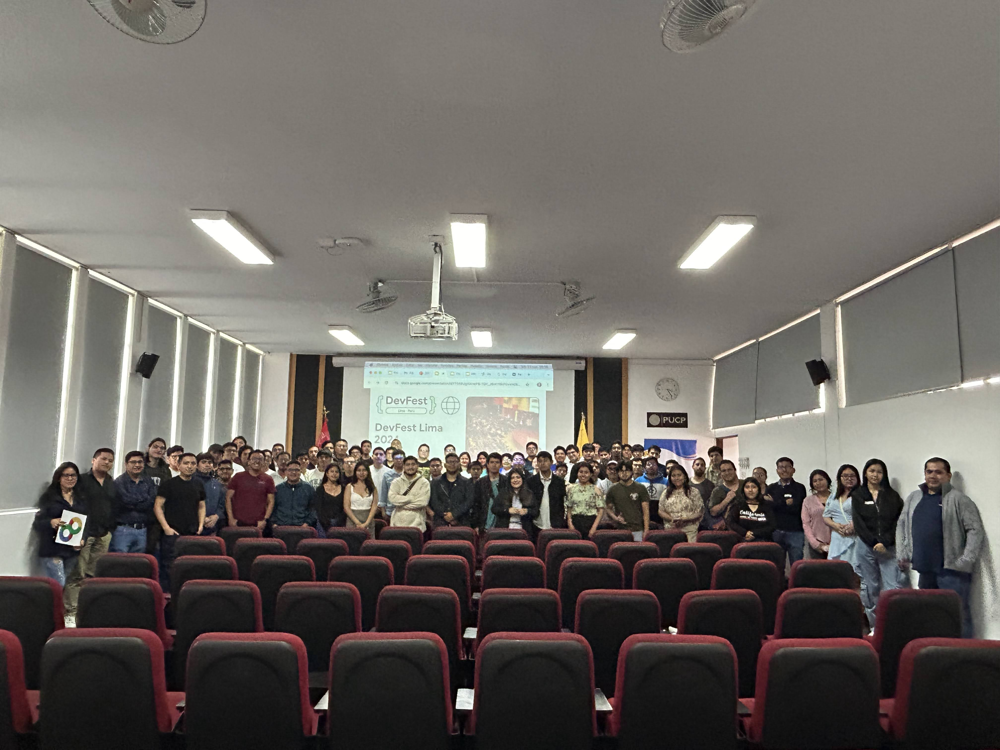

# DevFest Lima 2024

DevFest Lima 2024, Festival de desarrolladores orientado a IA, Cloud , Mobile y Web con charlas y talleres

[https://devfestlima.gdglima.com/](https://devfestlima.gdglima.com//)

Presentaciones :

Expositor | Tema  | Presentación | 
------------ | ------------- | ------------- |
Hector Lujan  | Seguridad de Datos |
Edgar Rios  | Nest y Typescript en el backend |
Rolando Fernandez	  | Estrategia Data Driven |
Juan Carlos Yovera	  | Arquitectura de software Web |
Natali Lujan	  | GCP para el Análisis de Datos: Descubre su Potencial|
GianCarlo Sandoval	  | Controla tu App en Tiempo Real: Remote Config con Flutter y Firebase|
Sebastian Levano  | Buenas prácticas de desarrollo de JavaScript |  
Enzo Peñaranda  | Conociendo Nearsure |
Julissa Rodriguez	  | Desplegando APIs Serverless con Terraform en Google Cloud Functions|
Homer Lopez	  | Conversaciones Mejoradas con IA: Chatbot Inteligente usando Gemini AI y Firebase|
Carlos Calla	  | DevSecOps en GCP |
Glisse Jorge Malca	  | Del Contenedor a la Nube: Aplicaciones Cloud Native con Google Cloud Run |

Talleres :

Expositor | Tema  | Taller | 
------------ | ------------- | ------------- |
Roy Surjano | Optimización de aplicaciónes web vía Prompt Engineering |
Lesly Samaritano | Generando contenido con la API de Gemini en la IU de Flutter |
Miguel Angel Cotrina | Creación de Pipelines de Datos con Apache Beam y Google Cloud Dataflow |
Percy Tuncar | Diseño y Desarrollo Simplificado con Next.js |

## Fotos

Compartimos nuestro albúm de fotos:

* [DevFest Lima 2024](https://photos.app.goo.gl/Tqei4nHorAZd7v7G7)

## Agradecimiento

Un especial agradecimiento al equipo humano que hizo posible este evento al equipo organizador ,voluntario , aliados y empresas que confiaron en nuestros DevFest Lima nos vemos el próximo DevFest Lima 2025

Sigan en nuestras redes sociales: 

* [GDG Lima](https://gdg.community.dev/gdg-lima/)
* [Linkedin](https://www.linkedin.com/company/gdg-lima---google-developer-group-lima)
* [Instagram](https://www.instagram.com/gdglima/)
* [X](https://www.x.com/gdglima/)
